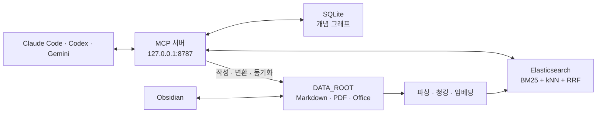

<div align="center">

# PKB

**내 문서만 검색하고, 내 컴퓨터에서 동작하는 개인 지식 베이스**

Elasticsearch 하이브리드 검색, MCP, Obsidian, SQLite Graph RAG를 하나의 로컬 워크플로로 연결합니다.

[](https://github.com/jjongkwann/personal-docs/actions/workflows/ci.yml)


[English](README.md) | **한국어**

</div>

PKB(Personal Knowledge Base)는 내가 선별한 Markdown, PDF, Office 문서를 로컬에서 색인하고 검색하는
MCP-first 지식 관리 시스템입니다. 웹 전체가 아니라 **내가 관리하는 코퍼스만** 검색하며, `DATA_ROOT`의
문서를 Source of Truth로 유지합니다.

Claude Code·Codex·Gemini에서는 MCP 도구로 검색·작성·인제스트할 수 있고, 사람은 같은 원본과 개념
노트를 Obsidian에서 직접 읽고 편집할 수 있습니다. PKB는 외부 LLM API를 호출하지 않고 API 키도
필요 없습니다 — 코드에 있는 유일한 LLM 호출은 선택 기능인 `pkb graph rebuild-evidence-local`이
로컬 Ollama 엔드포인트를 부르는 경우뿐입니다. 문서, Elasticsearch 인덱스, 개념 그래프는 모두
로컬에 저장됩니다.

## 핵심 기능

| 기능 | 설명 |
| --- | --- |
| 로컬 우선 | 개인 문서와 검색 인덱스를 로컬에 보관하며 별도의 LLM API 키가 필요하지 않습니다. |
| 하이브리드 검색 | nori BM25와 dense vector kNN(BGE-M3)을 RRF로 결합합니다. CrossEncoder 재순위는 옵션. |
| MCP-first 인터페이스 | 검색, 파일 작성, 변환, 동기화, 문서 관리, 그래프 순회를 22개 MCP 도구로 수행합니다. |
| 다양한 문서 인제스트 | Markdown, 텍스트, PDF, DOCX, PPTX, XLSX, HTML을 청킹하고 변경분만 다시 임베딩합니다. |
| Obsidian 연동 | 코퍼스를 볼트 안에 두고 원본 Markdown과 백링크를 직접 관리합니다. |
| Graph RAG | 개념과 근거를 SQLite에 저장하고 explain/path/subgraph 순회와 오프라인 Evidence Map 렌더를 지원합니다. |
| 안전한 운영 | 동기화 전 정리 후보 확인, 문서 아카이브·복구, 상태 점검, 검색 품질 평가를 지원합니다. |

## 동작 구조



- `DATA_ROOT`의 문서가 원본입니다. Elasticsearch와 SQLite 개념 그래프는 원본에서 다시 만들 수 있는 파생
  데이터입니다.
- 검색은 BM25와 벡터 검색 결과를 RRF로 합칩니다. CrossEncoder 재순위는 `RERANK_ENABLED`로
  켤 수 있으며 기본 비활성입니다 (자체 벤치에서 무재순위 대비 품질·지연 모두 열위).
- 개념 추출은 MCP 클라이언트의 에이전트가 수행하고, PKB는 결과를 SQLite에 저장합니다.

자세한 설계와 데이터 흐름은 [아키텍처 문서](docs/ko/architecture.md)에서 확인할 수 있습니다.

## 빠른 시작

### 사전 요구사항

- Python 3.11 이상
- Docker와 Docker Compose
- [uv](https://docs.astral.sh/uv/)
- MCP를 사용할 경우 Claude Code, Codex 또는 Gemini CLI

### 1. 설치

```bash
git clone https://github.com/jjongkwann/personal-docs.git
cd personal-docs

cp .env.example .env
uv sync --locked
docker compose up -d --build

uv run pkb init
uv run pkb doctor
```

> 최초 설치에는 Docker 이미지와 임베딩·리랭커 모델 다운로드를 위한 인터넷 연결이 필요합니다.
> 다운로드 이후 검색과 저장은 로컬에서 수행됩니다.

### 2. 문서 추가와 검색

`DATA_ROOT`의 기본값은 프로젝트 안의 `data/`입니다. 최상위 폴더명이 자동으로 카테고리가 됩니다.

```text
data/
├── study/       # 공부 노트, 논문
├── career/      # 경력, 기술 스택, 프로젝트
├── writing/     # 초안, 정리 노트
└── about/       # 자기소개, 관심사
```

문서를 원하는 카테고리 폴더에 넣은 뒤 인제스트하고 검색합니다.

```bash
uv run pkb add data/study
uv run pkb query "RAG 검색 품질을 개선하는 방법" --category study
```

개인 코퍼스는 `.gitignore`의 `data/*` 규칙으로 Git 추적에서 제외됩니다.

### 3. MCP 서버 연결

개발이나 확인 용도로 서버를 포그라운드에서 실행합니다.

```bash
uv run python -m pkb.mcp_server
```

다른 터미널에서 사용하는 클라이언트를 등록합니다.

```bash
# Claude Code
claude mcp add --transport http pkb http://127.0.0.1:8787/mcp -s user

# Codex
codex mcp add pkb --url http://127.0.0.1:8787/mcp

# Gemini CLI
gemini mcp add pkb http://127.0.0.1:8787/mcp -t http -s user
```

> MCP 서버는 임베딩·리랭커 모델 때문에 프로세스당 메모리를 많이 사용합니다. `stdio`로 에이전트/CLI 세션마다
> 실행하지 말고, `127.0.0.1:8787`의 **단일 HTTP 서버**를 여러 클라이언트가 공유하세요.

2026-07-28 MCP 업데이트에서 Streamable HTTP는 무상태가 되었습니다. 프로토콜 `initialize`
핸드셰이크와 `Mcp-Session-Id`가 없고, 각 요청이 자체 메타데이터를 전달합니다. 여기서 “세션”은
에이전트/CLI 대화 또는 프로세스를 뜻하며 프로토콜 세션이 아닙니다. 클라이언트가 `Mcp-Method`와
`Mcp-Name`을 자동 설정하므로 위 endpoint와 등록 명령에 헤더를 수동으로 추가할 필요가 없습니다.
PKB의 호출 간 애플리케이션 상태는 Elasticsearch/SQLite 또는 명시적 tool 인자/handle로 관리합니다.

macOS `launchd` 상시 실행, Claude Desktop 브리지, 연결 확인 방법은
[MCP 연동 가이드](docs/ko/mcp.md)를 참고하세요.

## 사용 예시

MCP가 연결된 에이전트에게 자연어로 요청할 수 있습니다.

```text
"내 study 자료에서 BM25와 벡터 검색을 비교한 내용을 찾아줘"
"~/Downloads/paper.pdf를 study 카테고리로 변환해서 넣어줘"
"저장된 career 문서 목록을 보여줘"
"방금 찾은 내용을 data/writing/search-notes.md로 정리해줘"
"DI, IoC, Bean, Container 개념이 어떻게 연결돼 있어?"
```

주요 MCP 도구는 다음과 같습니다.

| 작업 | 도구 |
| --- | --- |
| 검색 | `search_knowledge` |
| 작성·추가 | `write_file`, `read_file`, `patch_file`, `add_document`, `convert_and_ingest` |
| 조회·재색인 | `list_documents`, `get_document`, `reindex_document` |
| 동기화 | `sync_corpus`, `sync_obsidian` |
| 생명주기 | `archive_document`, `restore_document` |
| 상태 점검 | `doctor` |
| 개념 그래프 | `graph_explain`, `graph_path`, `graph_query`, `graph_affected`와 그래프 구축·큐레이션·노트 동기화 도구 |

전체 파라미터와 호출 예시는 [MCP 도구 문서](docs/ko/mcp.md)에 정리되어 있습니다.

## CLI 사용법

CLI는 색인 운영, 검증, 디버깅을 위한 보조 인터페이스입니다.

```bash
# 하이브리드 검색과 주변 청크 확인
uv run pkb query "DI IoC 의존성 주입" --category study
uv run pkb query "RAG 검색 품질 개선" --expand 1

# 원본과 검색 인덱스 재조정
uv run pkb sync

# 매핑 변경 후 전체 재인덱싱
uv run pkb reindex

# 문서 아카이브와 복구
uv run pkb archive data/career/old_resume.md --reason outdated
uv run pkb restore data/career/old_resume.md

# 개념 그래프 상태·조회
uv run pkb graph stats
uv run pkb graph explain "BM25"
uv run pkb graph path "BM25" "RRF"
uv run pkb graph query "키워드 검색과 벡터 검색은 어떻게 연결돼?"
uv run pkb graph map --concept "BM25" --open   # 오프라인 Evidence Map HTML

# 읽기 alias를 새 물리 인덱스로 전환 (예: 임베딩 모델 변경 후)
uv run pkb index-switch pkb_documents_v2
```

`purge-archived`와 `delete`는 물리 삭제를 수행합니다. 실행 전
[문서 생명주기 가이드](docs/ko/usage.md#문서-생명주기-만료--soft-delete)를 확인하세요.

모든 명령은 `uv run pkb --help`와 `uv run pkb <command> --help`로 확인할 수 있습니다.

## 지원 형식

| 형식 | 처리 방식 |
| --- | --- |
| `.md`, `.markdown`, `.txt` | 원문을 직접 읽고 Markdown 헤딩 구조를 보존합니다. |
| `.pdf` | `pdfminer`로 텍스트를 추출하고 `## p.N` 페이지 마커를 유지합니다. |
| `.docx`, `.pptx`, `.xlsx`, `.html`, `.htm` | `markitdown`으로 Markdown 변환 후 인제스트합니다. |

이미지 전용 PDF에는 OCR이 적용되지 않습니다.

## 설정

[.env.example](.env.example)을 복사해 시작할 수 있습니다. 아래 환경 변수를 `.env`에서 지정하지 않으면
애플리케이션 기본값이 사용됩니다.

| 환경 변수 | 기본값 | 설명 |
| --- | --- | --- |
| `ES_HOST` | `http://localhost:9200` | Elasticsearch 주소 |
| `ES_INDEX` | `pkb_documents` | 검색 인덱스 이름 |
| `DATA_ROOT` | `data` | 개인 코퍼스 원본 경로. Obsidian 볼트 하위 폴더 권장 |
| `OBSIDIAN_PATH` | 비활성 | `DATA_ROOT` 밖의 볼트 노트도 별도로 색인할 때 사용 |
| `RERANK_ENABLED` | `false` | CrossEncoder 재순위 활성화 |
| `CANDIDATE_K` | `20` | 재순위 전 후보 수 |
| `EXPAND_CONTEXT` | `0` | 검색 결과에 포함할 전후 청크 수 |
| `GRAPH_DB_PATH` | `data/.graph/pkb_graph.sqlite` | 개념 그래프 SQLite 경로 |
| `GRAPH_DEDUP_THRESHOLD` | `0.88` | 유사 개념 자동 병합 임계값 |
| `MCP_PORT` | `8787` | 공유 HTTP MCP 서버 포트 |

`DATA_ROOT`를 Obsidian 볼트 하위 폴더로 지정하면 원본과 에이전트가 작성한 문서가 볼트에
바로 나타납니다. 볼트의 나머지 문서까지 검색해야 할 때만 `OBSIDIAN_PATH`를 추가하세요.

## 프로젝트 구조

```text
personal-docs/
├── src/pkb/
│   ├── mcp_server.py   # MCP 도구와 HTTP 서버
│   ├── cli.py          # CLI 명령
│   ├── operations.py   # CLI·MCP가 공유하는 작성·변환·동기화 도메인 코어
│   ├── documents.py    # 문서 경로 해석, 조회, 생명주기
│   ├── ingest.py       # 문서 파싱, 청킹, 델타 인제스트
│   ├── retrieve.py     # BM25 + kNN + RRF 검색
│   ├── rerank.py       # CrossEncoder 재순위
│   ├── store.py        # Elasticsearch 저장소
│   ├── config.py       # 설정 (환경 변수로 오버라이드)
│   └── graph/          # SQLite 개념 그래프, 조회 질의, Evidence Map
├── tests/              # 단위·통합 테스트
├── docs/               # 아키텍처, MCP, CLI, Graph RAG 문서
├── Dockerfile.es       # nori 플러그인을 포함한 Elasticsearch
├── docker-compose.yml
└── pyproject.toml
```

## 문서

- [MCP 연동 가이드](docs/ko/mcp.md) — 서버 실행, 클라이언트 등록, 22개 도구와 사용 예시
- [아키텍처](docs/ko/architecture.md) — 구성 요소, 데이터 흐름, 동기화 책임
- [CLI 사용법](docs/ko/usage.md) — 인제스트, 검색, 문서 관리, 평가와 운영
- [Graph RAG](docs/ko/graph-rag.md) — 개념 추출, 그래프 저장, 네이티브 질의

## 개발 및 기여

```bash
uv sync --locked --dev
uv run ruff check .
uv run pytest -q
```

실제 Elasticsearch를 사용하는 통합 테스트는 컨테이너를 실행한 뒤 별도로 수행합니다.

```bash
docker compose up -d --build
PKB_ES_INTEGRATION=1 uv run pytest -q tests/test_es_integration.py
```

변경을 제안할 때는 관련 테스트와 문서를 함께 갱신하고, 개인 문서·절대 경로·환경 변수 값이 커밋에
포함되지 않았는지 확인해 주세요.

## 개인정보와 보안

- `data/*`와 `.env`는 기본적으로 Git에서 제외됩니다.
- Elasticsearch와 MCP 서버는 기본 설정에서 `127.0.0.1`에만 바인딩됩니다.
- PKB는 문서를 외부 API로 전송하지 않지만, MCP 클라이언트가 도구 결과를 처리하는 방식은 각
  클라이언트와 모델 제공자의 데이터 정책을 따릅니다.
- 저장소를 공개하기 전 `git status`와 커밋 이력에 개인 데이터가 없는지 반드시 확인하세요.

## 라이선스

[MIT](LICENSE). `DATA_ROOT` 아래의 개인 문서는 이 저장소에 포함되지 않으며 라이선스 대상도
아닙니다 — 라이선스는 PKB 코드에만 적용됩니다.
