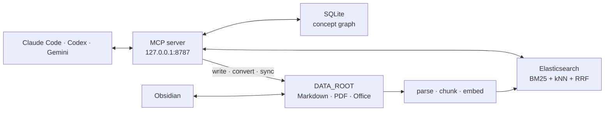

<div align="center">

# PKB

**A personal knowledge base that searches only your documents and runs on your machine**

Connects Elasticsearch hybrid search, MCP, Obsidian, and SQLite Graph RAG into a single local workflow.

[](https://github.com/jjongkwann/personal-docs/actions/workflows/ci.yml)


**English** | [한국어](README.ko.md)

</div>

PKB (Personal Knowledge Base) is an MCP-first knowledge management system that indexes and searches
your hand-picked Markdown, PDF, and Office documents locally. It searches **only the corpus you
curate** — not the whole web — and keeps the documents under `DATA_ROOT` as the source of truth.

From Claude Code, Codex, or Gemini you can search, write, and ingest through MCP tools, while you
read and edit the same originals directly in Obsidian. PKB never calls an
external LLM API and needs no API key — the only LLM call in the codebase is optional and targets a
local Ollama endpoint (`pkb graph rebuild-evidence-local`). Your documents, the Elasticsearch index,
and the concept graph all stay on your machine.

## Key Features

| Feature | Description |
| --- | --- |
| Local first | Personal documents and the search index stay local; no LLM API key required. |
| Hybrid search | Combines nori BM25 with dense vector kNN (BGE-M3) via RRF. CrossEncoder reranking is optional. |
| MCP-first interface | Search, file writing, conversion, sync, document management, and native graph traversal via 22 MCP tools. |
| Broad document ingestion | Chunks Markdown, text, PDF, DOCX, PPTX, XLSX, and HTML, re-embedding only what changed. |
| Obsidian integration | Keep the corpus inside your vault and manage original Markdown and backlinks directly. |
| Graph RAG | Stores concepts and evidence in SQLite, supports native explain/path/subgraph traversal, and renders an offline Evidence Map. |
| Safe operations | Pre-sync cleanup previews, document archive/restore, health checks, and search quality evaluation. |

## How It Works



- Documents under `DATA_ROOT` are the originals. Elasticsearch and the SQLite concept graph are derived
  data that can always be rebuilt from them.
- Search merges BM25 and vector results with RRF. CrossEncoder reranking can be enabled via
  `RERANK_ENABLED` and is off by default (in-house benchmarks showed it worse than no reranking on
  both quality and latency).
- Concept extraction is done by the MCP client's agent; PKB stores the results in SQLite.

See the [architecture document](docs/architecture.md) for the detailed design and data flow.

## Quick Start

### Prerequisites

- Python 3.11+
- Docker and Docker Compose
- [uv](https://docs.astral.sh/uv/)
- Claude Code, Codex, or Gemini CLI if you want MCP

### 1. Install

```bash
git clone https://github.com/jjongkwann/personal-docs.git
cd personal-docs

cp .env.example .env
uv sync --locked
docker compose up -d --build

uv run pkb init
uv run pkb doctor
```

> The first install needs an internet connection to download Docker images and the
> embedding/reranker models. After that, search and storage run locally.

### 2. Add documents and search

`DATA_ROOT` defaults to `data/` inside the project. Top-level folder names automatically become
categories.

```text
data/
├── study/       # study notes, papers
├── career/      # work history, tech stack, projects
├── writing/     # drafts, summary notes
└── about/       # self-introduction, interests
```

Drop documents into the category folder of your choice, then ingest and search.

```bash
uv run pkb add data/study
uv run pkb query "how to improve RAG retrieval quality" --category study
```

Your personal corpus is kept out of Git by the `data/*` rule in `.gitignore`.

### 3. Connect the MCP server

Run the server in the foreground for development or verification.

```bash
uv run python -m pkb.mcp_server
```

Register the client you use from another terminal.

```bash
# Claude Code
claude mcp add --transport http pkb http://127.0.0.1:8787/mcp -s user

# Codex
codex mcp add pkb --url http://127.0.0.1:8787/mcp

# Gemini CLI
gemini mcp add pkb http://127.0.0.1:8787/mcp -t http -s user
```

> The MCP server uses a lot of memory per process because of the embedding/reranker models. Don't
> spawn it per agent/CLI session via `stdio` — share a **single HTTP server** at `127.0.0.1:8787` across
> clients.

The 2026-07-28 MCP update makes Streamable HTTP stateless: there is no protocol `initialize`
handshake or `Mcp-Session-Id`, and each request carries its own metadata. “Session” here means an
agent/CLI conversation or process, not a protocol session. Clients automatically set `Mcp-Method` and
`Mcp-Name`, so the endpoint and registration commands above need no manual header configuration.
PKB keeps cross-call application state in Elasticsearch/SQLite or in explicit tool arguments/handles.

For always-on macOS `launchd` setup, the Claude Desktop bridge, and connection checks, see the
[MCP integration guide](docs/mcp.md).

## Usage Examples

Ask an MCP-connected agent in natural language.

```text
"Find the comparison of BM25 and vector search in my study notes"
"Convert ~/Downloads/paper.pdf and ingest it into the study category"
"Show me the list of stored career documents"
"Write up what we just found into data/writing/search-notes.md"
"How are the DI, IoC, Bean, and Container concepts connected?"
```

The main MCP tools:

| Task | Tools |
| --- | --- |
| Search | `search_knowledge` |
| Write / add | `write_file`, `read_file`, `patch_file`, `add_document`, `convert_and_ingest` |
| Inspect / reindex | `list_documents`, `get_document`, `reindex_document` |
| Sync | `sync_corpus`, `sync_obsidian` |
| Lifecycle | `archive_document`, `restore_document` |
| Health check | `doctor` |
| Concept graph | `graph_explain`, `graph_path`, `graph_query`, `graph_affected`, plus graph build/curation/note-sync tools |

Full parameters and call examples are documented in the [MCP tool reference](docs/mcp.md).

## CLI Usage

The CLI is a secondary interface for index operations, verification, and debugging.

```bash
# Hybrid search and neighboring-chunk expansion
uv run pkb query "DI IoC dependency injection" --category study
uv run pkb query "improving RAG retrieval quality" --expand 1

# Reconcile originals with the search index
uv run pkb sync

# Full reindex after mapping changes
uv run pkb reindex

# Archive and restore documents
uv run pkb archive data/career/old_resume.md --reason outdated
uv run pkb restore data/career/old_resume.md

# Concept graph stats and queries
uv run pkb graph stats
uv run pkb graph explain "BM25"
uv run pkb graph path "BM25" "RRF"
uv run pkb graph query "how do lexical and vector retrieval connect?"
uv run pkb graph map --concept "BM25" --open   # offline Evidence Map HTML

# Swap the read alias to a new physical index (e.g. after an embedding model change)
uv run pkb index-switch pkb_documents_v2
```

`purge-archived` and `delete` perform physical deletion. Check the
[document lifecycle guide](docs/usage.md#document-lifecycle-expiry--soft-delete) before running them.

All commands are listed via `uv run pkb --help` and `uv run pkb <command> --help`.

## Supported Formats

| Format | Handling |
| --- | --- |
| `.md`, `.markdown`, `.txt` | Read as-is, preserving the Markdown heading structure. |
| `.pdf` | Text extracted with `pdfminer`, keeping `## p.N` page markers. |
| `.docx`, `.pptx`, `.xlsx`, `.html`, `.htm` | Converted to Markdown with `markitdown`, then ingested. |

OCR is not applied to image-only PDFs.

## Configuration

Start by copying [.env.example](.env.example). If a variable below is not set in `.env`, the
application default applies.

| Variable | Default | Description |
| --- | --- | --- |
| `ES_HOST` | `http://localhost:9200` | Elasticsearch address |
| `ES_INDEX` | `pkb_documents` | Search index name |
| `DATA_ROOT` | `data` | Path to the personal corpus originals. An Obsidian vault subfolder is recommended |
| `OBSIDIAN_PATH` | disabled | Set to also index vault notes outside `DATA_ROOT` |
| `RERANK_ENABLED` | `false` | Enable CrossEncoder reranking |
| `CANDIDATE_K` | `20` | Candidate count before reranking |
| `EXPAND_CONTEXT` | `0` | Number of neighboring chunks to include in results |
| `GRAPH_DB_PATH` | `data/.graph/pkb_graph.sqlite` | Concept graph SQLite path |
| `GRAPH_DEDUP_THRESHOLD` | `0.88` | Auto-merge threshold for similar concepts |
| `MCP_PORT` | `8787` | Shared HTTP MCP server port |

Point `DATA_ROOT` at a subfolder of your Obsidian vault and the originals and agent-written documents
appear in the vault directly. Add `OBSIDIAN_PATH` only when you also need to
search the rest of the vault.

## Project Structure

```text
personal-docs/
├── src/pkb/
│   ├── mcp_server.py   # MCP tools and HTTP server
│   ├── cli.py          # CLI commands
│   ├── operations.py   # write/convert/sync domain core shared by CLI and MCP
│   ├── documents.py    # document path resolution, lookup, lifecycle
│   ├── ingest.py       # document parsing, chunking, delta ingestion
│   ├── retrieve.py     # BM25 + kNN + RRF search
│   ├── rerank.py       # CrossEncoder reranking
│   ├── store.py        # Elasticsearch store
│   ├── config.py       # settings, overridable via environment variables
│   └── graph/          # SQLite concept graph, read queries, Evidence Map
├── tests/              # unit and integration tests
├── docs/               # architecture, MCP, CLI, Graph RAG docs
├── Dockerfile.es       # Elasticsearch with the nori plugin
├── docker-compose.yml
└── pyproject.toml
```

## Documentation

- [MCP integration guide](docs/mcp.md) — running the server, client registration, the 22 tools with examples
- [Architecture](docs/architecture.md) — components, data flow, sync responsibilities
- [CLI usage](docs/usage.md) — ingestion, search, document management, evaluation and operations
- [Graph RAG](docs/graph-rag.md) — concept extraction, graph storage, and native queries

## Development & Contributing

```bash
uv sync --locked --dev
uv run ruff check .
uv run pytest -q
```

Integration tests against a real Elasticsearch run separately, after starting the container.

```bash
docker compose up -d --build
PKB_ES_INTEGRATION=1 uv run pytest -q tests/test_es_integration.py
```

When proposing changes, update the related tests and docs together, and make sure no personal
documents, absolute paths, or environment variable values end up in the commit.

## Privacy & Security

- `data/*` and `.env` are excluded from Git by default.
- Elasticsearch and the MCP server bind to `127.0.0.1` only in the default configuration.
- PKB never sends your documents to external APIs, but how MCP clients handle tool results is
  governed by each client's and model provider's data policy.
- Before making the repository public, always check `git status` and the commit history for
  personal data.

## License

[MIT](LICENSE). Your own documents under `DATA_ROOT` are not part of this repository and are not
covered by it — the license applies to the PKB code only.
